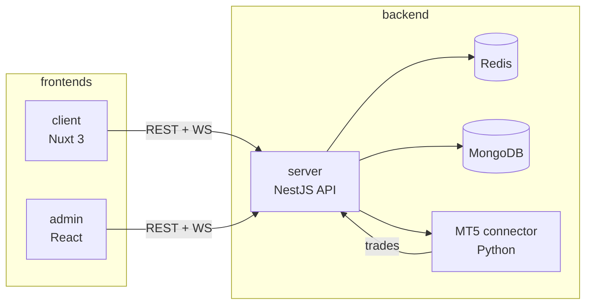

# MiroNext — Platform Architecture

## System map

## Responsibility boundaries

| Layer | Owns | Does NOT own |
|-------|------|--------------|
| **server** | Auth, signals, copy-trading logic, payments, referrals, WebSocket events, admin API | UI rendering, i18n strings |
| **client** | User dashboard, trader UX, RTL layout, locale files | Business rules, direct DB access |
| **admin** | Operator workflows (KYC, withdrawals, settings) | Public user flows |

## API contract

- **Source of truth:** server OpenAPI (`/api/docs-json`)
- **Admin-specific routes:** `server/ADMIN_PANEL_API.md`
- **Full REST catalog:** `server/API_DOCUMENTATION.md`

When changing an endpoint, update **server first**, then align client/admin API calls.

## Cross-repo change checklist

1. Schema/DTO change in **server** → update Swagger + tests
2. New/changed endpoint → update **client** and/or **admin** API layer
3. WebSocket event change → update both frontends' socket handlers
4. New env var → document in `server/docs/ai-context/deployment.md`
5. i18n key → client `fa.json`/`en.json` (admin if applicable)

## Risk level

**CRITICAL** — financial copy-trading platform. Wrong PnL, lot size, or withdrawal logic causes real monetary loss. Always test math and full data path.
